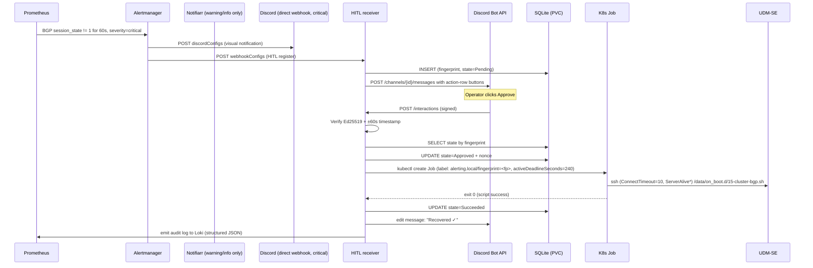

# Cluster alerting framework with human-in-the-loop Discord remediation

## Summary

Implement the alerting + HITL framework defined in the origin brainstorm in three phases. Phase 1 enables Alertmanager with Discord/Notifiarr severity-routed receivers and sink-independent meta-monitoring. Phase 2 adds the BGP session-state PrometheusRule (POC). Phase 3 stands up a custom Python/FastAPI HITL receiver (Robusta does not support verified Discord button callbacks today) with SQLite-on-Longhorn-PVC state, AlertmanagerConfig `webhookConfigs` fanout, Discord interaction signature verification, and a one-click BGP-recovery playbook that SSHs to UDM-SE under per-playbook RBAC.

**Plan structure:** 15 implementation units across 3 phases. U-IDs U5 and U14 are gaps (deepening pass collapsed blackbox-exporter into a ScrapeConfig CR within U6, and demoted external one-time setup from a numbered unit to a "Phase 3 Prerequisites" section).

---

## Problem Frame

Alertmanager is `enabled: false` today (`clusters/main/kubernetes/system/kube-prometheus-stack/app/helm-release.yaml:38-39`), so the cluster has no notification pipeline. Layer 1 (UDM cron healthcheck) and Layer 2A (uptime-kuma TCP probe) are deployed; this plan delivers Layer 2B — metric-aware alerting with optional one-click remediation — as defined in the origin brainstorm.

(see origin: `docs/brainstorms/2026-05-07-cluster-alerting-hitl-requirements.md`)

---

## Requirements

All 22 origin R-IDs are inherited verbatim. The plan-side traceability:

| Origin | Plan units that satisfy it |
|---|---|
| R1 (AM + PVC) | U1 |
| R2 (two receivers, secretKeyRef) | U2, U3 |
| R3 (severity routing, exclusive) | U3, U8 |
| R4 (severity rubric + flap PromQL) | U3, U10 |
| R5 (BGP PrometheusRule POC) | U9 |
| R6 (CI guard + negative fixtures + meta-assertion) | U8 |
| R7-R10 (HITL receiver: signature, replay, allowlist) | U11, U13 |
| R11 (Cloudflare Tunnel + WAF + middleware + NetworkPolicy) | U15 |
| R12 (playbook registration contract) | U16 |
| R13 (per-playbook RBAC, scoped to dedicated SSH Secret) | U13 (split secrets), U17 |
| R14 (state machine + durability + reconciliation incl. orphan-Pending) | U11 |
| R15 (snooze + cancel-on-resolve) | U11 |
| R16 (failure escalation) | U11 |
| R17 (audit log schema) | U11 |
| R18 (Watchdog/NotifiarrDown/PrometheusDown, sink-indep, per-route groupInterval) | U6, U7 (ScrapeConfig folded into U6; manual uptime-kuma setup is U7) |
| R19 (internal AM UI ingress) | U4 |
| R20 (Secrets vs ConfigMap, split alert-remediation + udm-ssh secrets) | U2, U13 |
| R21 (UDM SSH constrained, Secret split for least-privilege) | U13, U17 |
| R22 (BGP playbook + nonce + SSH timeouts + Job shape + adoption cap) | U17 |

**Origin acceptance examples:** the 14 gameday scenarios (Validation section in origin) are the framework-level acceptance suite. Per-unit test scenarios below cover narrower behaviors.

---

## Scope Boundaries

- Concrete PrometheusRules beyond R5 BGP. Each new alert lands as an additive PR using the framework.
- Email, SMS, mobile-push notification channels.
- Multi-cluster Alertmanager federation.
- Replacement of the uptime-kuma Layer 2A TCP probe (kept as silent backstop).
- Fully autonomous remediation. Discord approval is the ONLY remediation trigger in this framework.

### Deferred to Follow-Up Work

- Audit-log Grafana dashboard (Loki has the data per R17): separate PR.
- Alert noise tuning beyond v1 thresholds: iterative once live.
- `docs/runbooks/adding-an-alert.md` template: separate PR.
- Secondary critical sink (Pushover/SMTP/ntfy backstop for Discord-itself-down): Discord-as-SPOF accepted for v1.
- Tamper-resistant audit-log forwarding: future defense-in-depth.
- Off-cluster uptime-kuma (LXC on Proxmox) to break the residual k8s/Cilium/DNS/WAN convergence: documented residual risk in R18.
- Custom CRD (`HITLAlertState`) as eventual scaling path if SQLite single-replica becomes a bottleneck.

---

## Context & Research

### Relevant Code and Patterns

- `clusters/main/kubernetes/system/kube-prometheus-stack/app/helm-release.yaml` — current chart values; toggle alertmanager at `:38-39`. `*SelectorNilUsesHelmValues: false` (`:52-56`) means cross-namespace AlertmanagerConfig discovery already enabled.
- `clusters/main/kubernetes/system/kube-prometheus-stack/app/alertmanagerconfig.yaml` — fully commented-out template (Pushover/heartbeat/null receivers). **Reuse the shape** — `secretKeyRef` pattern, `Watchdog` + `InfoInhibitor` route handling, inhibit rules. Extend rather than rewrite.
- `clusters/main/kubernetes/system/uptime-kuma/app/uptime-kuma-auth.secret.yaml` — canonical multi-key SOPS Secret pattern.
- `clusters/main/kubernetes/system/uptime-kuma/app/servicemonitor.yaml` — standalone ServiceMonitor with basicAuth.
- `clusters/main/kubernetes/system/dcgm-exporter/`, `system/smartctl-exporter/`, `system/pve-exporter/` — exporter helm-release shape to model blackbox-exporter from.
- `clusters/main/kubernetes/core/traefik/app/middleware-{bouncer,internal-secure-chain,internal-allowlist,local-whitelist,secure-chain}.yaml` — Middleware CRD shape; cross-namespace refs use `namespace: traefik`.
- `clusters/main/kubernetes/core/cloudflared/app/helm-release.yaml` — cloudflared chart, **token-only**; tunnel public hostnames are managed in the Cloudflare Zero Trust dashboard (manual op).
- `clusters/main/kubernetes/core/ddns-cloudflare/app/cronjob.yaml` — reference pod template for any one-shot Job (python:3.12-alpine, `envFrom: secretRef`, hardened `securityContext`, runAsUser 65534, drop-ALL caps).
- `clusters/main/kubernetes/apps/media/notifiarr/app/helm-release.yaml` — in-cluster Notifiarr at `http://notifiarr.media.svc.cluster.local:5454`, uses `${NOTIFIARR_API}` from clusterenv.
- `clusters/main/kubernetes/networking/truenas/app/helm-release.yaml` — example of `internal-secure-chain` cross-namespace ref via `expandObjectName: false`.
- `clusters/main/clusterenv.yaml` — variables like `BASE_DOMAIN`, `NOTIFIARR_IP`, `NOTIFIARR_API`, `DISCORD_TOKEN`, `CLOUDFLARE_TOKEN`. **No** `PUSHOVER_*`, `NTFY_*`, `ALERTMANAGER_*`, `HITL_*` yet — to be added.
- `clusters/main/kubernetes/flux-entry.yaml:19-20,34-35` — confirms `postBuild.substituteFrom` against `cluster-config`. Any literal `${...}` in PrometheusRule expressions, AM templates, or dashboard JSON MUST be escaped to `$${...}` (origin R2 ban on envsubst for webhook URLs).
- `docs/network/udm-se/15-cluster-bgp.sh` — R22 playbook target on UDM-SE.

### Institutional Learnings

- The 0-byte `15-cluster-bgp.sh` after a UDM reboot (2026-05-06) is the inciting incident. R22 playbook must validate non-empty before declaring success — script-zero-but-condition-persists is an explicit R16 outcome code.
- WAN IP changes break `wethecommon.com` and `plex.sf.wethecommon.com` A records; existing DDNS only updates `vpn.wethecommon.com` (`project_cloudflare_tunnel_fix.md`). The new `discord-hitl.${BASE_DOMAIN}` should land as a CNAME to apex (free DDNS inheritance) rather than a new A record.
- Pi-hole stale local DNS overrides have bitten this cluster. Audit Pi-hole `.3` and `.244` plus Blocky `customDNS.mapping` when adding any new hostname (`project_unifi_stp_research_2026_04.md`).
- TrueCharts middleware `lookup()` chicken-and-egg means new middlewares may fail first reconcile. Install with ingress disabled, then enable (CLAUDE.md gotcha).
- Flux `postBuild` substitution previously broke Grafana dashboards with `${DS_VAR}` patterns. Same risk applies to PromQL `{{ template ... }}` expressions in AM templates; verify `./forgetool checkcrypt` and dry-run before commit.

### External References

- AlertmanagerConfig v1beta1 (kube-prometheus-stack 84.5.0 / prometheus-operator ≥ 0.79): native `discordConfigs` with `apiURL` as `SecretKeySelector` — added in operator v0.69. Set `alertmanagerConfigSelector` + `alertmanagerConfigMatcherStrategy: { type: None }` on the Alertmanager CR for cluster-wide routing without per-namespace matcher injection.
- Discord Interactions API: `X-Signature-Ed25519` + `X-Signature-Timestamp` headers; verify with raw body bytes against application public key; community-canonical timestamp window is 5 minutes; no published IP allowlist (signature is canonical defense).
- Discord bot button posting: requires `bot` + `applications.commands` OAuth scopes; channel perms `View Channel` + `Send Messages` + `Embed Links`; Interactions Endpoint URL set in Developer Portal triggers Discord PING (type 1) → must respond PONG.
- Robusta: Discord sink is webhook-only outbound. No verified-button-callback support, no built-in OSS state store. Excluded — custom receiver chosen.

---

## Key Technical Decisions

- **Custom Python/FastAPI HITL receiver, not Robusta.** Robusta has no verified Discord button callback support today (2026); the runner is webhook-outbound only. Building a small focused receiver is faster and cheaper than waiting on upstream.
- **State store: SQLite on a 1Gi Longhorn PVC, mounted RWO into a single-replica Deployment.** Pod restart remounts the PVC; SQLite via stdlib (no extra dependency); zero new infrastructure. Trade-off: cannot horizontally scale — accepted (one operator, one home-lab cluster). **PRAGMAs at connection init:** `journal_mode=WAL`, `synchronous=NORMAL`, `busy_timeout=5000`. **Concurrency:** uvicorn `workers=1` (async only); multi-process SQLite on Longhorn RWO is undefined behavior. **Schema:** all writes use `INSERT ... ON CONFLICT(fingerprint) DO UPDATE` to absorb AM webhook redelivery races during reconciliation.
- **Receiver Deployment `strategy: Recreate`, NOT RollingUpdate.** RWO PVC mount cannot be held by two pods during rollout. Liveness probe: `initialDelaySeconds: 60` to absorb Longhorn cold-start mount (10-30s) + reconciler runtime. Readiness probe: separate `/ready` endpoint that returns 503 until lifespan/reconciler completes, decoupled from `/health` (which is a liveness check including a `SELECT 1` against the SQLite store to detect lock/corruption).
- **Per-playbook RBAC scopes to dedicated Secret resources, NOT shared ones.** The UDM SSH key lives in its own SOPS Secret `udm-ssh-secret.secret.yaml` so the BGP-recovery playbook ServiceAccount can have `secrets/get` on ONLY `udm-ssh-secret`. The bot token, operator allowlist, and HMAC replay secret remain in `alert-remediation-secrets`, accessible only by the receiver SA. A compromised playbook image cannot exfiltrate the bot token or replay secret. This is the correct application of K8s RBAC granularity (resource-level, not key-level).
- **FastAPI `/interactions` handler signature is `request: Request` only — no Pydantic body model.** The receiver MUST call `await request.body()` first, pass those raw bytes to Ed25519 verify, THEN call `json.loads()` on the same bytes. A typed body parameter triggers Pydantic parse before the handler executes, making raw-bytes verification impossible. This is enforced as an architectural constraint, not a comment.
- **AlertmanagerConfig v1beta1 with `discordConfigs` for non-HITL alerts and `webhookConfigs`-only for HITL alerts (single-message UX).** Critical/warning alerts WITHOUT a `remediation` label route to receivers that include `discordConfigs` (visual notification). Critical alerts WITH a `remediation` label route to a receiver that has ONLY `webhookConfigs` to the HITL receiver — the HITL receiver's bot-posted button message IS the notification. This avoids the double-page anti-pattern (single user-facing message per alert) at the cost of coupling visual delivery to receiver health for HITL alerts. R18 meta-monitoring catches receiver-down and surfaces it via the sink-independent uptime-kuma path.
- **Per-route `groupInterval` overrides for the Watchdog matcher.** The global `groupInterval: 5m` would cause Watchdog (a continuously-firing alert) to emit webhooks every 5 min, breaking R18a's claimed 1-min cadence and dead-man's-switch SLO. The Watchdog route MUST set `groupInterval: 30s` (or shorter) to deliver the heartbeat at the rule-evaluation cadence.
- **`alertmanagerConfigMatcherStrategy: type: None`** on the Alertmanager CR. Default `OnNamespace` injects a `namespace=` matcher into every route, breaking cluster-wide routing. Set `type: None` so the CRD-rooted route applies as authored.
- **Component placement: `clusters/main/kubernetes/system/alert-remediation/`**. Layer = `system` (infrastructure, alongside kube-prometheus-stack); not `apps/` (which is reserved for end-user applications).
- **Image hosting: build receiver image via GitHub Actions, publish to `ghcr.io/<owner>/alert-remediation-hitl`**, Renovate-tracked digest (`@sha256:...`). Deployment manifest references the digest, NOT a `:latest` tag — tag references defeat reproducibility and break the rollback claim.
- **NetworkPolicy on `alert-remediation` namespace, ingress-only.** Permits inbound to receiver Service:8080 from (a) `traefik` namespace pod selector (Discord callbacks) and (b) `kube-prometheus-stack` namespace (AM webhookConfigs). All other inbound denied. Without this, any cluster pod can bypass Traefik/CrowdSec/WAF and POST to the receiver, leaving R8 signature verify as the sole defense.
- **Receiver Discord rate-limit handling.** Local token bucket (4 req/s per channel default), honor 429 `Retry-After` header, async queue: AM webhook handler always 200s the webhook (records state) and queues the Discord post asynchronously. Prevents AM retry storms when Discord rate-limits during flap cascades.
- **Outbound HTTP timeouts on Discord/AM clients.** `connect=5s`, `read=10s`, max 3 retries with exponential backoff + jitter. Prevents a hung Discord/AM API call from blocking the worker indefinitely.
- **HMAC `hitl-replay-secret` rotation contract.** Two-key window with 24-hour overlap. `key_id` is stored in the `hitl_state` row at nonce generation time. On rotation, both old and new keys are loaded; nonces with `key_id` matching either are accepted; after the overlap window expires, only the new key. Concrete rotation procedure in `docs/runbooks/alerting-secret-rotation.md`.
- **Probes via `ScrapeConfig` CR + the existing `prometheus-blackbox-exporter` sub-chart**, NOT a separate Helm component. kube-prometheus-stack already sets `scrapeConfigSelectorNilUsesHelmValues: false`, meaning a single `ScrapeConfig` CR can define HTTP probes against Notifiarr. The R18c PrometheusDown path stays in uptime-kuma (sink-independent). The probe-side machinery is one CR, no namespace, no helm-release.
- **uptime-kuma push monitor + Pushover/ntfy notification channels are configured manually via the uptime-kuma UI**, not in repo. Documented as a one-time operational setup with screenshots/runbook to follow.
- **Cloudflare Tunnel `discord-hitl.${BASE_DOMAIN}` hostname is added via the Cloudflare Zero Trust dashboard**, not Flux. The cloudflared chart in this repo is token-only. WAF rule (signature-header gating + 10 req/s) is also dashboard-managed.
- **Reuse the existing commented `alertmanager-secret` pattern** in `kube-prometheus-stack/app/alertmanagerconfig.yaml` rather than authoring a new shape. Extend with Discord/Notifiarr/Pushover keys; keep `Watchdog` + `InfoInhibitor` route handling.
- **Discord bot creation + Interactions URL registration is a one-time external step** with a documented procedure. Captured in Phase 3 prerequisites.

---

## Open Questions

### Resolved During Planning

- *Robusta vs custom receiver?* → Custom (Robusta has no Discord button callback support).
- *State store?* → SQLite on Longhorn PVC with WAL mode + busy_timeout=5000 + workers=1.
- *State store schema choice (CRD vs DB)?* → SQLite tables with `(fingerprint PRIMARY KEY, state, alertname, created_at, updated_at, nonce, key_id, correlation_id, audit_json, snooze_until, job_name)` columns. All writes use `INSERT ON CONFLICT(fingerprint) DO UPDATE`.
- *Receiver replicas?* → 1 (single operator, no leader election needed; PVC RWO mount).
- *Per-severity routing fanout shape (single vs double message)?* → **Single message UX**: alerts WITHOUT `remediation` label use `discordConfigs`; alerts WITH `remediation` label route to a `webhookConfigs`-only receiver. The HITL bot post IS the notification — avoids double-paging.
- *AlertmanagerConfig matcher strategy?* → `type: None` to disable namespace-injection.
- *Watchdog cadence?* → Per-route `groupInterval: 30s` override on the watchdog matcher; global default stays `5m`.
- *Image registry / pinning?* → ghcr.io, image referenced by `@sha256:` digest with Renovate tracking. Never `:latest`.
- *blackbox-exporter shape?* → `ScrapeConfig` CR using kube-prometheus-stack's existing scrape config support. NOT a separate Helm component.
- *Discord interaction PING/PONG handler?* → Implemented in receiver; Discord requires PONG response on URL registration.
- *Playbook RBAC scope?* → Per-Secret split: `udm-ssh-secret` is its own resource so the playbook SA scopes only to it. `alert-remediation-secrets` (bot token, allowlist, replay secret) is receiver-only.
- *FastAPI body parsing for signature verify?* → Handler signature is `request: Request` only; `await request.body()` first; pass raw bytes to verify; then `json.loads()`. Architectural constraint, not a comment.
- *NetworkPolicy on receiver namespace?* → Required: ingress from `traefik` + `kube-prometheus-stack` only.
- *HMAC rotation contract?* → Two-key window with 24h overlap; `key_id` stored alongside nonce.
- *Liveness probe semantics?* → `/health` endpoint includes `SELECT 1` against SQLite; separate `/ready` endpoint returns 503 until lifespan complete.
- *Discord rate-limit handling?* → Local token bucket 4 req/s per channel; honor 429 Retry-After; async queue webhook acks.

### Deferred to Implementation

- Receiver image base — `python:3.12-alpine` matches repo convention; minor: switch to distroless if hardening is needed later.
- Exact PromQL templating in AM message bodies — requires iteration once live alerts surface.
- Pushover vs ntfy choice for R18a sink — both work; user picks during U7 manual setup.
- Cloudflare WAF rule exact expression — documented in U15; refined when registering the hostname.
- Whether to escape `${VAR}` in playbook YAML manifests — likely yes for parity with dashboards; verified during U16.
- Concrete `docs/runbooks/alerting-secret-rotation.md` script content — rotation contract is pinned (two-key 24h overlap with `key_id`); script details deferred until the secret is in active use.
- Job ownerReferences vs label-only adoption — both viable for R14 reconciliation. Plan chose label-only for cross-pod-restart adoption; reconsider if Job orphan accumulation becomes an operational issue.

---

## Output Structure

    clusters/main/kubernetes/system/
    ├── alert-remediation/                          # NEW component
    │   ├── ks.yaml
    │   └── app/
    │       ├── kustomization.yaml
    │       ├── namespace.yaml
    │       ├── deployment.yaml                     # HITL receiver, replicas: 1, strategy: Recreate
    │       ├── service.yaml                        # ClusterIP for Traefik backend
    │       ├── pvc.yaml                            # 1Gi Longhorn for SQLite
    │       ├── networkpolicy.yaml                  # NEW (rev2): ingress from traefik + kube-prometheus-stack only
    │       ├── ingressroute.yaml                   # Traefik IngressRoute, no internal middleware
    │       ├── middleware-discord-callback-chain.yaml  # bouncer-only, NO local-whitelist
    │       ├── rbac.yaml                           # receiver SA + minimal cluster-side perms (incl. Jobs CRUD)
    │       ├── playbook-rbac-bgp-recovery.yaml     # per-playbook SA: Secret/get on udm-ssh-secret ONLY
    │       ├── playbook-bgp-recovery.yaml          # playbook manifest (R12 contract)
    │       ├── alert-remediation-secrets.secret.yaml  # bot token, allowlist, replay secret (NO ssh key — split per rev2)
    │       ├── udm-ssh-secret.secret.yaml          # NEW (rev2): UDM SSH private key only — separate Secret for least-privilege RBAC
    │       ├── alert-remediation-config.yaml       # ConfigMap: app pubkey, known_hosts, playbook registry
    │       └── servicemonitor.yaml                 # scrape receiver's /metrics
    ├── kube-prometheus-stack/                      # MODIFY existing
    │   └── app/
    │       ├── helm-release.yaml                   # MODIFY: alertmanager.enabled = true
    │       ├── alertmanagerconfig.yaml             # MODIFY: replace commented template; route remediation alerts to webhookConfigs-only receiver; per-route Watchdog groupInterval: 30s
    │       ├── alertmanager-secret.secret.yaml     # NEW: webhook URLs, replaces ${VAR} envsubst
    │       ├── prometheusrule-meta.yaml            # NEW: Watchdog, NotifiarrDown, generic up{job=~"cilium-agent|blackbox-exporter"}==0
    │       ├── prometheusrule-bgp.yaml             # NEW: BGP session-state + flap classification recording rule
    │       ├── scrapeconfig-blackbox.yaml          # NEW (rev2): replaces standalone blackbox-exporter component
    │       ├── ingressroute-alertmanager.yaml      # NEW: alert.sf.${BASE_DOMAIN}
    │       └── promtool-tests/                     # NEW: unit tests for flap rule
    │           ├── flap-test.yaml
    │           └── README.md
    └── kustomization.yaml                          # MODIFY: register alert-remediation/ (NOT blackbox-exporter — folded into ScrapeConfig CR)

    .github/workflows/
    ├── alert-remediation-image.yaml                # NEW: build + push receiver image
    └── prometheus-rules-ci.yaml                    # NEW: amtool + kubectl --dry-run=server + promtool

    .github/workflows/fixtures/                     # NEW: R6 negative-fixture corpus
    ├── bad-severity-mistag.yaml
    ├── bad-route-continue-true-to-discord.yaml
    └── bad-alertmanagerconfig-malformed.yaml

    apps/alert-remediation-hitl/                    # NEW: receiver source code (separate from k8s manifests)
    ├── pyproject.toml
    ├── Dockerfile
    ├── README.md
    ├── src/alert_remediation_hitl/
    │   ├── __init__.py
    │   ├── main.py                                 # FastAPI app + signature verification
    │   ├── state.py                                # SQLite access + state machine
    │   ├── reconciler.py                           # Startup reconciliation (R14)
    │   ├── discord_client.py                       # Bot API: post message + components
    │   ├── alertmanager_client.py                  # AM API: silences, expireSilence
    │   ├── playbooks.py                            # Registry + dispatcher
    │   ├── audit.py                                # Loki structured logging
    │   └── nonce.py                                # HMAC nonce generator/verifier
    └── tests/
        ├── test_signature.py
        ├── test_state_machine.py
        ├── test_nonce.py
        └── test_reconciler.py

    docs/runbooks/
    ├── alerting-discord-bot-setup.md               # NEW: Discord app/bot creation, Interactions URL
    ├── alerting-cloudflare-tunnel-add-host.md      # NEW: dashboard steps for discord-hitl
    ├── alerting-uptime-kuma-push-setup.md          # NEW: UI walkthrough for Watchdog + Pushover
    └── alerting-secret-rotation.md                 # NEW: replay-secret + bot-token rotation

---

## Phase 3 Prerequisites (manual ops, not implementation units)

These are external one-time operations required before Phase 3 can be tested live. They are NOT implementation units (no code or manifest is produced); they are operator runbooks. Captured here so the implementation flow doesn't try to land them as PRs.

### Discord application + bot setup

1. Create Discord application at developer portal.
2. Add bot user; record Bot Token.
3. Record Application Public Key.
4. OAuth URL with permissions for `View Channel + Send Messages + Embed Links + Manage Messages` (last is required for the bot to edit its own posted messages after the 15-min interaction-token window expires; without it, "Recovered ✓" / "Already executed" message edits will silently 403). Permissions integer: `274877924352` (compute via Discord developer permission calculator).
5. Invite bot to designated alert channel.
6. Set Interactions Endpoint URL to `https://discord-hitl.${BASE_DOMAIN}/interactions` AFTER U15 lands (chicken-and-egg: Discord pings the URL before saving; the receiver must be live).
7. Populate `alert-remediation-secrets.secret.yaml` (U13) with Bot Token; populate `alert-remediation-config.yaml` with Public Key.

### Cloudflare Tunnel hostname add

1. Cloudflare Zero Trust dashboard → Networks → Tunnels → existing tunnel `edadc32f-...`.
2. Add public hostname: subdomain `discord-hitl`, domain `${BASE_DOMAIN}`, type `HTTPS`, URL `traefik.traefik.svc.cluster.local:443`.
3. WAF rule: scope by `(http.host eq "discord-hitl.${BASE_DOMAIN}") and (http.request.method eq "POST")`; require both `X-Signature-Ed25519` and `X-Signature-Timestamp` headers non-empty; rate-limit 10/s per source IP.
4. Verify DNS via `dig discord-hitl.${BASE_DOMAIN}` (Cloudflare auto-creates the CNAME).

### uptime-kuma push monitor + Pushover/ntfy notification (covered by U7)

See U7 for the runbook. Listed here for ordering completeness.

### Pi-hole / Blocky DNS audit

Before testing, ensure no stale `discord-hitl.*` mapping exists in either Pi-hole `.3` or `.244` or in Blocky `customDNS.mapping`. New hostnames added to Cloudflare Tunnel inherit DNS from the apex CNAME but local DNS overrides can shadow them.

### Runbooks (created during U13 / U17 work)

- `docs/runbooks/alerting-discord-bot-setup.md`
- `docs/runbooks/alerting-cloudflare-tunnel-add-host.md`
- `docs/runbooks/alerting-uptime-kuma-push-setup.md` (created by U7)
- `docs/runbooks/alerting-secret-rotation.md` (covers replay secret rotation contract)

---

## High-Level Technical Design

> *This illustrates the intended approach and is directional guidance for review, not implementation specification. The implementing agent should treat it as context, not code to reproduce.*

### Alert flow (Phase 3, BGP critical case)



### Reconciliation-on-startup (R14)

```
on receiver pod start:
  1. open SQLite
  2. SELECT * FROM hitl_state WHERE state IN (Pending, Snoozed, Approved)
  3. for each row:
       Snoozed -> query AM for current alert state
                  -> if resolved: call expireSilence; UPDATE state=Auto-resolved; audit silence_cancelled_on_resolve
                  -> else: continue (silence still valid)
       Approved -> kubectl get jobs -l alerting.local/fingerprint=<fp>
                  -> if Job exists & running: watch to completion (do NOT relaunch)
                  -> if Job missing or Failed: UPDATE state=Timeout; emit remediation_failed
       Pending  -> no-op (button message still live in Discord; click handler will resume)
  4. ONLY THEN: bind FastAPI HTTP listener, accept Discord interactions
```

### State machine (carried verbatim from origin, encoded as DB transitions)

State transitions in SQLite are guarded by a single UPDATE-WHERE-state-IN clause to prevent races; idempotent Approve double-clicks are detected by checking `state=Approved AND nonce IS NOT NULL` and replying "already executed" without re-launching the Job.

---

## Implementation Units

### Phase 1 — Alertmanager + Routing + Meta-monitoring

- U1. **Enable Alertmanager with persistent storage**

**Goal:** Bring Alertmanager online with a 1Gi Longhorn PVC and `alertmanagerConfigMatcherStrategy: type: None` so AlertmanagerConfig CRDs from any namespace apply cluster-wide without auto-injected namespace matchers.

**Requirements:** R1.

**Dependencies:** None.

**Files:**
- Modify: `clusters/main/kubernetes/system/kube-prometheus-stack/app/helm-release.yaml`

**Approach:**
- Set `alertmanager.enabled: true`.
- Set `alertmanager.alertmanagerSpec.retention: 120h`, `alertmanagerSpec.storage.volumeClaimTemplate.spec.{storageClassName: longhorn, resources.requests.storage: 1Gi}`, `alertmanagerSpec.alertmanagerConfigSelector: {}` (match all), `alertmanagerSpec.alertmanagerConfigMatcherStrategy.type: None`.
- Keep prometheus, grafana, exporters untouched.

**Patterns to follow:**
- Prometheus's existing `storageSpec.volumeClaimTemplate` block (`:90-95`) for PVC shape.

**Test scenarios:**
- Edge case: pod restart preserves silences. *Action:* `amtool silence add` via API; delete AM pod; wait for restart; query silences. *Expected:* silence still active (Covers AE — origin gameday step 10).
- Integration: AlertmanagerConfig from a different namespace is picked up. *Action:* apply test AlertmanagerConfig in any namespace, label match ensures inclusion. *Expected:* receiver appears in `/api/v2/status` config dump.

**Verification:**
- `kubectl get pod -n kube-prometheus-stack` shows `alertmanager-kube-prometheus-stack-alertmanager-0` Ready.
- `kubectl get pvc -n kube-prometheus-stack` shows the AM PVC bound to a Longhorn volume sized 1Gi.

---

- U2. **SOPS Secrets and ConfigMaps for receiver wiring**

**Goal:** Provide all webhook URLs, tokens, allowlists, and non-sensitive material per origin R20's class separation. Do NOT use `${VAR}` envsubst for any of these (origin R2 ban).

**Requirements:** R2, R20.

**Dependencies:** None.

**Files:**
- Create: `clusters/main/kubernetes/system/kube-prometheus-stack/app/alertmanager-secret.secret.yaml` — keys `discord-critical-url`, `notifiarr-default-url`, `pushover-token`, `pushover-user-key`, `ntfy-creds-token` (alternate path; Pushover OR ntfy chosen at U7).
- Modify: `clusters/main/clusterenv.yaml` — add `${DISCORD_CRITICAL_WEBHOOK}`, `${PUSHOVER_TOKEN}`, `${PUSHOVER_USER_KEY}` for downstream cluster vars (NOT for AM webhook URLs themselves — those go in the SOPS Secret).

**Approach:**
- Use the canonical `*.secret.yaml` shape with `stringData:` block holding all keys; `.sops.yaml` regex `(stringData|password|token|key|secret|...)` encrypts in place.
- Webhook URLs go in `stringData` (encrypted); AlertmanagerConfig references them via `secretKeyRef` to this single Secret.

**Patterns to follow:**
- `clusters/main/kubernetes/system/uptime-kuma/app/uptime-kuma-auth.secret.yaml` for multi-key shape.
- `clusters/main/kubernetes/system/kube-prometheus-stack/app/homeassistant-token.secret.yaml` for single-key example.

**Test scenarios:**
- Happy path: `./forgetool checkcrypt` passes after stringData population. *Expected:* exit 0; no plaintext secrets in committed file.
- Edge case: a key with `:` or `/` characters round-trips through SOPS. *Action:* set a Notifiarr URL containing `?api=...&channel=...`. *Expected:* `sops --decrypt | yq '.stringData."notifiarr-default-url"'` returns the original URL byte-for-byte.

**Verification:**
- `./forgetool checkcrypt` passes.
- `kubectl get secret alertmanager-secret -n kube-prometheus-stack -o yaml` shows all expected keys after Flux reconciliation.

---

- U3. **AlertmanagerConfig — receivers, severity routing, single-message HITL fanout, per-route Watchdog cadence**

**Goal:** Replace the commented-out template at `kube-prometheus-stack/app/alertmanagerconfig.yaml` with a v1beta1 AlertmanagerConfig that (a) defines `discord-critical`, `notifiarr-default`, `hitl-only`, `null`, and `watchdog-uptime-kuma` receivers; (b) routes severity exclusively (no double-fanout); (c) suppresses `discordConfigs` for alerts carrying a `remediation` label (single-message HITL UX); (d) overrides `groupInterval: 30s` on the Watchdog matcher; (e) preserves `InfoInhibitor` and inhibit rules from the prior template. **Note (rev2):** Watchdog routing is folded into U3 from the start, NOT added later by U6 — single authoring unit per file.

**Requirements:** R2, R3, R4 (severity rubric), R18a (Watchdog cadence), R20.

**Dependencies:** U1, U2.

**Files:**
- Modify: `clusters/main/kubernetes/system/kube-prometheus-stack/app/alertmanagerconfig.yaml` (uncomment + extend).
- Modify: `clusters/main/kubernetes/system/kube-prometheus-stack/app/kustomization.yaml` — register the resource.

**Approach:**
- `apiVersion: monitoring.coreos.com/v1beta1`, `kind: AlertmanagerConfig`, `metadata.name: cluster-routing`, `metadata.namespace: kube-prometheus-stack`.
- `spec.route.groupBy: [alertname, severity]`, `groupWait: 30s`, `groupInterval: 5m`, default `repeatInterval: 24h`.
- Routes via `spec.route.routes[]`, each with `matchers` + `continue: false` (mutually exclusive). Order matters — more specific matchers first:
  - `watchdog: "true"` → receiver `watchdog-uptime-kuma`, `groupInterval: 30s`, `repeatInterval: 1m`. **Per-route override of the global 5m default — required to deliver R18a's 1-min cadence.**
  - `severity=critical, remediation=~".+"` → receiver `hitl-only` (webhookConfigs ONLY — single-message UX; HITL bot post is the notification), `repeatInterval: 4h`.
  - `severity=critical` → receiver `discord-critical`, `repeatInterval: 4h`.
  - `severity=warning` → receiver `notifiarr-default`, `repeatInterval: 12h`.
  - `severity=info` → receiver `null` (Loki/Grafana only).
- Receivers:
  - `discord-critical`: `discordConfigs` with `apiURL.name: alertmanager-secret, apiURL.key: discord-critical-url`.
  - `hitl-only`: `webhookConfigs` to `http://alert-remediation-hitl.alert-remediation.svc.cluster.local:8080/webhook/hitl`. NO `discordConfigs`.
  - `notifiarr-default`: `webhookConfigs` (Notifiarr is HTTP) with URL via `urlSecret`.
  - `watchdog-uptime-kuma`: `webhookConfigs` to uptime-kuma push endpoint URL (filled in via `urlSecret` from `alertmanager-secret`).
  - `null`: empty receiver (sink alerts to Loki only).
- Inhibit rules: critical inhibits warning for the same `alertname`, etc. (preserve from commented template).

**Execution note:** Test-first — write the route-tree fixture first (a synthetic critical alert routes to `discord-critical` AND ONLY `discord-critical`), then author the CRD until it passes.

**Patterns to follow:**
- The original commented-out template's matcher list, inhibit rules, and `Watchdog`/`InfoInhibitor` route handling — preserve these.
- AlertmanagerConfig v1beta1 schema (no v1alpha1 — operator silently converts but pin the newer shape).

**Test scenarios:**
- Happy path (Covers origin gameday 4): Synthetic `severity=critical` alert via AM API → only `discord-critical` receives. *Expected:* one Discord post; no Notifiarr traffic.
- Happy path: Synthetic `severity=warning` → only `notifiarr-default` receives. *Expected:* Notifiarr endpoint hit; no direct Discord.
- Edge case: `severity=info` alert → no Discord, no Notifiarr. *Expected:* alert visible in AM `/api/v2/alerts` but no notifications fired.
- Error path: alert with no `severity` label → falls through default route (null receiver). *Expected:* no notification, no error.
- Integration: Watchdog rule from U6 routes through correctly. *Expected:* Watchdog never reaches Discord/Notifiarr (it routes to webhookConfigs for uptime-kuma push only).

**Verification:**
- `amtool config routes test severity=critical alertname=BGPSessionDown` returns `discord-critical`.
- `amtool config routes test severity=warning` returns `notifiarr-default`.
- `amtool config routes test severity=info` returns `null`.
- AM `/api/v2/status` shows the loaded config matches the CRD source.

---

- U4. **Internal ingress for Alertmanager UI**

**Goal:** Expose the AM UI at `alert.sf.${BASE_DOMAIN}` behind `internal-secure-chain` (LAN/VPN only) for operator silence management.

**Requirements:** R19.

**Dependencies:** U1.

**Files:**
- Create: `clusters/main/kubernetes/system/kube-prometheus-stack/app/ingressroute-alertmanager.yaml`
- Modify: `clusters/main/kubernetes/system/kube-prometheus-stack/app/kustomization.yaml`

**Approach:**
- Traefik `IngressRoute` (CRD), entryPoint `websecure`, host `alert.sf.${BASE_DOMAIN}`, service `kube-prometheus-stack-alertmanager:9093`.
- Middleware ref: `internal-secure-chain` from `traefik` namespace via `expandObjectName: false`-style annotation.
- TLS via cert-manager `wethecommon-prod-cert` cluster issuer.

**Patterns to follow:**
- `clusters/main/kubernetes/networking/truenas/app/helm-release.yaml` for cross-namespace middleware ref shape.

**Test scenarios:**
- Happy path: from a LAN host, `curl https://alert.sf.${BASE_DOMAIN}` returns the AM UI. *Expected:* HTTP 200, AM dashboard.
- Error path: from a non-LAN public IP (test via cellular), same URL returns 403 (internal-allowlist denies). *Expected:* 403.
- Integration: Pi-hole/Blocky resolves the hostname to Traefik (.196). *Expected:* `dig alert.sf.${BASE_DOMAIN}` returns 192.168.10.196.

**Verification:**
- DNS resolves via internal resolver to Traefik IP.
- `curl -k https://alert.sf.${BASE_DOMAIN}/-/ready` from LAN returns OK.

---

- U5. **(deepening gap)** — blackbox-exporter component was collapsed into U6's ScrapeConfig CR. U5 is intentionally an unused U-ID. See U6 for the probe machinery.

---

- U6. **Meta-monitoring: ScrapeConfig + PrometheusRules (Watchdog, NotifiarrDown, generic up==0)**

**Goal:** All meta-monitoring scrape config + rules per origin R18 (a/b/c). One `ScrapeConfig` CR replaces the rev1 standalone blackbox-exporter Helm component. Three PrometheusRules: Watchdog (heartbeat at 1-min eval cadence — actual delivery cadence guaranteed by U3's per-route `groupInterval: 30s`), NotifiarrDown (probe_success against Notifiarr URL), and a generic `up{job=~"cilium-agent|alertmanager|blackbox-exporter"} == 0 for: 5m` rule covering scrape-target-down failure modes that R18c (uptime-kuma → /-/healthy probe) doesn't catch.

**Requirements:** R18 (a/b/c — Watchdog, NotifiarrDown, scrape-failure visibility).

**Dependencies:** U1, U3 (routing — Watchdog route already in U3 from rev2).

**Files:**
- Create: `clusters/main/kubernetes/system/kube-prometheus-stack/app/prometheusrule-meta.yaml`
- Create: `clusters/main/kubernetes/system/kube-prometheus-stack/app/scrapeconfig-blackbox.yaml`
- Modify: `clusters/main/kubernetes/system/kube-prometheus-stack/app/kustomization.yaml`

**Approach:**
- `ScrapeConfig` CR (`monitoring.coreos.com/v1alpha1`, kind `ScrapeConfig`):
  - Static target: `http://notifiarr.media.svc.cluster.local:5454/health` (or whatever Notifiarr's health endpoint is).
  - Module: `http_2xx`.
  - Backend: a small in-cluster blackbox-exporter sub-deployment from the existing `prometheus-blackbox-exporter` chart (deployed inline via kube-prometheus-stack values OR a tiny side-helm-release). **Decision deferred to ce-work:** if the kube-prometheus-stack `additionalScrapeConfigs` block is simpler, use that path. Either way, the ScrapeConfig is one CR file, not a separate component.
- `PrometheusRule` `metadata.namespace: kube-prometheus-stack`, group `meta-monitoring`:
  - `Watchdog`: `expr: vector(1)`, `for: 0s`, `labels: { severity: info, watchdog: "true" }`. The 1-min heartbeat cadence is delivered via U3's per-route `groupInterval: 30s` override on the `watchdog: "true"` matcher (NOT via the rule's `for:` field).
  - `NotifiarrDown`: `expr: probe_success{instance="http://notifiarr.media.svc.cluster.local:5454/health"} == 0`, `for: 2m`, `labels: { severity: critical }`.
  - `ScrapeTargetDown`: `expr: up{job=~"cilium-agent|alertmanager|blackbox-exporter|kube-prometheus-stack-prometheus"} == 0`, `for: 5m`, `labels: { severity: warning }`. Catches the gap that R18c probes Prometheus health but not individual scrape targets.

**Test scenarios:**
- Happy path: 3 consecutive Watchdog webhooks reach uptime-kuma push endpoint within ≈3 minutes (Covers Phase 1 acceptance criterion c). **Note:** the actual delivery is 1-per-minute via U3's groupInterval override; verifying this catches the rev1 bug where global `groupInterval: 5m` would have delivered every 5 min.
- Happy path: stop the Watchdog rule → uptime-kuma fires Pushover/ntfy within 5 min (Covers acceptance criterion c follow-up).
- Happy path (Covers Phase 1 acceptance d): Delete Alertmanager pod → uptime-kuma fires Pushover/ntfy within 5 min (heartbeats stop because AM stops emitting).
- Error path: kill Notifiarr (set replicas=0) → blackbox `probe_success` flips to 0 → after 2 min `for:`, NotifiarrDown fires → reaches `discord-critical` directly (NOT through Notifiarr). *Expected:* Discord post within 2-3 min (Covers origin gameday 3).
- Error path: induce a cilium-agent crashloop (e.g., temporarily corrupt its config) → after 5 min `for:`, ScrapeTargetDown fires `severity=warning` → reaches Notifiarr. *Expected:* warning notification within 5-7 min.

**Verification:**
- `up` for the rule group returns 1.
- Watchdog webhook delivery interval measured directly at the uptime-kuma push log: ~60s (not 5m).
- Manual induced AM-down test fires Pushover within 5 min.
- Manual induced Notifiarr-down test fires Discord direct within 3 min.
- Manual induced cilium-agent scrape failure fires ScrapeTargetDown within 5-7 min.

---

- U7. **uptime-kuma push monitor + Pushover/ntfy notification channel (manual ops)**

**Goal:** Configure uptime-kuma's UI-driven push monitor to receive Watchdog heartbeats and alert via Pushover (or ntfy) on heartbeat-stop. This is the sink-independent path per R18a.

**Requirements:** R18 (sink independence).

**Dependencies:** U6.

**Files:**
- Create: `docs/runbooks/alerting-uptime-kuma-push-setup.md` — stepwise UI walkthrough.

**Approach:**
- In uptime-kuma UI: create push monitor named `cluster-watchdog`; copy push token; configure interval 60s + `Maximum Retries: 3` (3 missed heartbeats = ≈5 min).
- Add Pushover (or ntfy) notification channel; bind to `cluster-watchdog` monitor.
- Pushover credentials added to U2's `alertmanager-secret` (or a new `uptime-kuma-pushover.secret.yaml`) — uptime-kuma UI accepts these via mounted env vars or pasted into the UI.
- Update U6's AlertmanagerConfig Watchdog route URL to point at the new push token endpoint.

**Test expectation:** none — this unit is operational/manual. Tests live in U6 (heartbeat plumbing) and U6's verification (induced AM-down).

**Verification:**
- 3 consecutive heartbeats visible in uptime-kuma UI.
- Test notification fires (uptime-kuma "Test" button on the channel) and reaches Pushover/ntfy.
- Heartbeat-stop simulation (deactivate monitor, then reactivate) triggers an actual Pushover/ntfy alert within the configured window.

---

- U8. **CI guard: amtool + kubectl --dry-run=server + promtool + negative-fixture corpus**

**Goal:** GitHub Actions workflow that runs on PRs touching `clusters/main/kubernetes/system/kube-prometheus-stack/**` or `clusters/main/kubernetes/system/alert-remediation/**`. Validates: (a) AM route tree via `amtool`, (b) AlertmanagerConfig CRD shape via `kubectl apply --dry-run=server` against the live cluster, (c) PrometheusRule unit tests via `promtool test rules`. Plus a committed corpus of three negative fixtures that MUST fail validation.

**Requirements:** R6.

**Dependencies:** U3 (CRD to validate), U6 (rules to test).

**Files:**
- Create: `.github/workflows/prometheus-rules-ci.yaml`
- Create: `.github/workflows/fixtures/bad-severity-mistag.yaml` — `severity: warn` (not in `{critical, warning, info}`).
- Create: `.github/workflows/fixtures/bad-route-continue-true-to-discord.yaml` — route with `continue: true` reaching `discord-critical`.
- Create: `.github/workflows/fixtures/bad-alertmanagerconfig-malformed.yaml` — malformed `route.matchers` field.
- Create: `clusters/main/kubernetes/system/kube-prometheus-stack/app/promtool-tests/flap-test.yaml` — synthetic series for the R4 flap rule.
- Create: `clusters/main/kubernetes/system/kube-prometheus-stack/app/promtool-tests/README.md`.

**Approach:**
- Workflow steps: checkout → install amtool/promtool → run amtool against route YAML extracted from CRD → run promtool against rule files → run kubectl --dry-run=server against AlertmanagerConfig (requires kubeconfig from secret).
- Negative fixtures live under `.github/workflows/fixtures/` (NOT under `clusters/main/` so Flux ignores them); workflow runs each through validation and **asserts non-zero exit per fixture** (i.e., `! amtool config show fixtures/bad-severity-mistag.yaml`). This is the meta-test of the CI guard itself: a regression that disables amtool entirely would otherwise turn all fixtures green.
- Positive control: real CRD validates clean (zero exit).
- Workflow also asserts that the kubeconfig secret is present and the dry-run actually contacts the cluster — if the kubeconfig secret expires, the dry-run step skips silently. Fail loudly when the kubeconfig is missing rather than silently passing.

**Execution note:** Author the workflow test-first — write the negative fixtures first and confirm they would fail validation before writing the production CRD content.

**Patterns to follow:**
- Existing GitHub Actions workflows in `.github/workflows/` — reuse repo's standard checkout + auth pattern.

**Test scenarios:**
- Edge case: PR introducing `severity: warn` → fixture catches → CI fails with amtool error mentioning `severity` enum.
- Edge case: PR introducing `continue: true` to a route reaching `discord-critical` → fixture catches → CI fails with route-exclusivity error.
- Edge case: PR introducing malformed `route.matchers` → kubectl --dry-run=server fails with CRD-shape error (NOT amtool, which only sees post-conversion YAML).
- Happy path: well-formed change passes all three checks. *Expected:* CI green.
- Happy path: synthetic flap series — 4 firing edges in 10 min triggers `flap_active=1`; 3 firing edges does not.

**Verification:**
- All three negative fixtures fail CI as expected (PR with intentional bad content shows red).
- promtool flap test passes for both positive and negative cases.

---

### Phase 2 — BGP alert (no HITL)

- U9. **BGP session-state PrometheusRule (POC alert)**

**Goal:** Single PrometheusRule firing `BGPSessionDown` when `cilium_bgp_control_plane_session_state` for the `192.168.10.1:179` peer falls off `1` (Established) for 60s. Labels: `severity: critical`, `remediation: bgp-recovery` (this label gates HITL button posting in Phase 3).

**Requirements:** R5.

**Dependencies:** U1, U3 (routing).

**Files:**
- Create: `clusters/main/kubernetes/system/kube-prometheus-stack/app/prometheusrule-bgp.yaml`
- Modify: `clusters/main/kubernetes/system/kube-prometheus-stack/app/kustomization.yaml`

**Approach:**
- Group `cilium-bgp`, rule `BGPSessionDown`.
- `expr: cilium_bgp_control_plane_session_state{neighbor="192.168.10.1:179"} != 1`, `for: 60s`.
- Annotations: `summary`, `description` with peer details + LAN-side troubleshooting hint.
- Labels: `severity: critical`, `remediation: bgp-recovery`.

**Patterns to follow:**
- Standard prometheus-operator `PrometheusRule` shape; no special tricks.

**Test scenarios:**
- Happy path (Covers origin gameday 4 + Phase 2 acceptance a): Stop FRR on UDM-SE → BGP session goes non-Established → after 60s `for:`, alert lands in `discord-critical` within ≤90s of trigger. *Expected:* Discord post received.
- Happy path (Covers Phase 2 acceptance b): Restart FRR → BGP re-establishes → AM emits resolved within 60s. *Expected:* Discord notification update OR resolve message.
- Edge case: spurious 5s session blip (less than `for: 60s` window) → does NOT fire. *Expected:* no Discord post.

**Verification:**
- Induced BGP-down test produces a Discord post in the dedicated channel within 90s.
- Induced restoration produces a resolve notification within 60s.

---

- U10. **Flap-classification companion rule + promtool tests**

**Goal:** Add a companion rule that detects 4+ firing↔resolve transitions in a 30-minute window and emits a `flap_active=1` series; AlertmanagerConfig (U3) uses this label to demote severity one tier within the window.

**Requirements:** R4 (flap classification).

**Dependencies:** U9 (rule to flap-detect), U3 (matchers for downgrade routing).

**Files:**
- Modify: `clusters/main/kubernetes/system/kube-prometheus-stack/app/prometheusrule-bgp.yaml` — add the flap recording rule.
- Modify: `clusters/main/kubernetes/system/kube-prometheus-stack/app/alertmanagerconfig.yaml` — add a route matcher: when `flap_active="true"`, demote `critical` → `warning`.
- Modify: `clusters/main/kubernetes/system/kube-prometheus-stack/app/promtool-tests/flap-test.yaml` (already created in U8) — encode the synthetic series.

**Approach:**
- Use the canonical PromQL pinned by origin R4: `sum_over_time(changes(ALERTS{alertname="BGPSessionDown",alertstate="firing"}[1m])[30m:1m]) >= 4`. This avoids the broken `changes(ALERTS_FOR_STATE)` form.
- Equivalent recording rule: emit `bgp_flap_active{...} = 1` while the condition holds; demote routing matches on this label.
- Keep the rule generic enough that future alerts can add their own `<alertname>_flap_active` recording rules.

**Execution note:** Test-first via `promtool test rules`. The fixture in U8 already establishes the test harness.

**Patterns to follow:**
- prometheus-operator recording-rule shape; `record:` field instead of `alert:`.

**Test scenarios:**
- Happy path: 4 firing edges of `BGPSessionDown` in 10 minutes → `bgp_flap_active=1` for the remainder of the 30-min window. *Expected:* AM routes the demoted alert through `notifiarr-default` instead of `discord-critical`.
- Edge case: 3 firing edges → flap is NOT active. *Expected:* alerts continue routing critical.
- Edge case: 4 edges spread across 31 min (window-edge fixture — encoded explicitly in `flap-test.yaml`, not just mentioned in prose) → flap is NOT active at minute 31 because the 1st edge has rolled out of the `[30m:1m]` subquery window. *Expected:* `bgp_flap_active=0`.

**Verification:**
- promtool tests pass: positive (4-edge fixture) and negative (3-edge fixture) both behave per spec.
- Manual flap induction (toggle FRR 4 times in 10 min) results in the 4th notification arriving via Notifiarr, not Discord direct.

---

### Phase 3 — HITL receiver + BGP playbook

- U11. **HITL receiver application (FastAPI)**

**Goal:** The custom Python receiver implementing R7-R10 (Discord interactions + signature + replay + authorization), R14 (state machine + durability + reconciliation), R15 (snooze with cancel-on-resolve), R16 (failure escalation), R17 (audit log emission), and R22 nonce.

**Requirements:** R7, R8, R9, R10, R14, R15, R16, R17, R22 (nonce + state).

**Dependencies:** None at the application level (containerized in U12).

**Files:**
- Create: `apps/alert-remediation-hitl/pyproject.toml`
- Create: `apps/alert-remediation-hitl/src/alert_remediation_hitl/main.py` — FastAPI app: `/interactions` POST handler, `/health`, `/metrics`, `/webhook/<receiver-name>` (AM webhookConfigs target).
- Create: `apps/alert-remediation-hitl/src/alert_remediation_hitl/state.py` — SQLite schema + state-machine transitions (guarded UPDATE-WHERE-state-IN clauses).
- Create: `apps/alert-remediation-hitl/src/alert_remediation_hitl/reconciler.py` — startup reconciliation pass (R14 contract).
- Create: `apps/alert-remediation-hitl/src/alert_remediation_hitl/discord_client.py` — Bot API: post/edit message with action-row buttons.
- Create: `apps/alert-remediation-hitl/src/alert_remediation_hitl/alertmanager_client.py` — AM API: silence create / expireSilence + resolution webhook listener.
- Create: `apps/alert-remediation-hitl/src/alert_remediation_hitl/playbooks.py` — load playbook YAMLs from configured registry path; dispatch via `kubectl apply` Job.
- Create: `apps/alert-remediation-hitl/src/alert_remediation_hitl/audit.py` — structured JSON logger to stdout (Loki picks up via Promtail/Alloy).
- Create: `apps/alert-remediation-hitl/src/alert_remediation_hitl/nonce.py` — HMAC-SHA256(server-secret, fingerprint || server_wall_clock_ms); `nonce_created_at` is server-generated, NOT client-supplied.
- Create: `apps/alert-remediation-hitl/tests/test_signature.py` — Ed25519 verify happy path + tampered body + tampered timestamp + missing header.
- Create: `apps/alert-remediation-hitl/tests/test_state_machine.py` — table-driven: from-state × event × expected to-state + audit event (covers all transitions in origin's state diagram).
- Create: `apps/alert-remediation-hitl/tests/test_nonce.py` — generation deterministic for fixed inputs; replay rejected; key rotation rejects old nonce.
- Create: `apps/alert-remediation-hitl/tests/test_reconciler.py` — Snoozed → Auto-resolved on resolved alert; Approved with running Job → adopt; Approved with missing Job → Timeout.
- Create: `apps/alert-remediation-hitl/Dockerfile`
- Create: `apps/alert-remediation-hitl/README.md` — local-dev quickstart.

**Approach:**
- Stack: Python 3.12, FastAPI, uvicorn (single worker), PyNaCl (Ed25519), httpx (Discord/AM API with explicit timeouts), stdlib `sqlite3`. No SQLAlchemy needed — schema is fixed and small.
- **SQLite configuration at connection init (mandatory):** `PRAGMA journal_mode=WAL; PRAGMA synchronous=NORMAL; PRAGMA busy_timeout=5000; PRAGMA foreign_keys=ON;`. Without WAL, the default `journal_mode=DELETE` serializes ALL access — concurrent reconciler/webhook/interaction writes would deadlock under load with `SQLITE_BUSY` errors surfacing as 5xx to AM, triggering retry storms.
- **uvicorn `workers=1`** (async only). Multi-process SQLite on Longhorn RWO is undefined behavior. Concurrency comes from FastAPI's async event loop.
- **SQLite schema:** `hitl_state(fingerprint TEXT PRIMARY KEY, state TEXT NOT NULL, alertname TEXT, created_at TEXT, updated_at TEXT, nonce TEXT, key_id TEXT, correlation_id TEXT, audit_json TEXT, snooze_until TEXT, job_name TEXT)`. **All writes use `INSERT INTO hitl_state(...) VALUES(...) ON CONFLICT(fingerprint) DO UPDATE SET ...`** to absorb AM webhook redelivery races during reconciliation (no UNIQUE-constraint failures on duplicate webhooks).
- **Reconciler runs synchronously in app startup BEFORE binding the HTTP listener** — origin R14 mandates this ordering. Implement as a FastAPI `lifespan` async-context startup hook. Reconciler pseudo-flow (covers all 4 state branches from the High-Level Design):
  - For each `Snoozed` row: query AM `/api/v2/alerts?filter=alertname=...` for the underlying alert. If resolved → call `expireSilence`, transition `Snoozed → Auto-resolved`, audit `silence_cancelled_on_resolve`. If still firing → no-op (silence still valid).
  - For each `Approved` row: list Jobs by label `alerting.local/fingerprint=<fp>`. If running → adopt and watch to completion (no relaunch). If completed → read exit code, transition. If missing entirely → transition `Approved → Timeout`, emit `remediation_failed`. If TWO Jobs found (unexpected) → fail loudly with audit `duplicate_jobs_detected`; do not pick one silently.
  - For each `Pending` row WITH `correlation_id NOT NULL`: no-op (button message still live in Discord; click handler resumes).
  - **For each `Pending` row WITH `correlation_id IS NULL`** (orphan from receiver crash between INSERT and Discord post): retry the bot post once. If still fails (Discord API down), transition `Pending → Orphaned` (terminal), emit `pending_orphaned` audit. **This is the rev-2 fix for the "crash mid-post" race.**
- **Discord interaction flow:** FastAPI handler signature is `async def interactions(request: Request)` — **NO Pydantic body model on this route** (would parse before signature verify). Inside: `body = await request.body()` → verify Ed25519 against raw bytes → check `abs(now - ts) <= 60` (symmetric window — both past AND future skew) → if Discord PING (type 1) reply PONG → else MESSAGE_COMPONENT click → look up state by fingerprint encoded in `custom_id` → guarded `UPDATE WHERE fingerprint=? AND state IN (...)` transition → reply 200 with deferred-update response → spawn background task to launch Job/silence/etc.
- **Webhook flow:** `/webhook/<receiver>` accepts AM's webhook payload → for each alert with `remediation:<playbook-name>` label: `INSERT ... ON CONFLICT(fingerprint) DO UPDATE`, then post Discord button message via bot API, store `correlation_id`. Always 200 the webhook back to AM (even if Discord post is queued/rate-limited).
- **Discord rate-limit handling:** local async token bucket (`asyncio.Semaphore`-backed at ≈4 req/s per channel). All Discord API calls wrapped in retry-on-429 honoring `Retry-After`. The webhook handler queues the bot post (does not block on Discord) so AM receives 200 even if Discord is rate-limiting.
- **HTTP client timeouts (httpx):** `connect=5s`, `read=10s`, retries=3 with exponential backoff + jitter. Applied to Discord API and AM API clients alike.
- **HMAC nonce:** `nonce.py` exports `generate_nonce(fingerprint, server_wall_clock_ms, secret, key_id)` and `verify_nonce(stored_nonce, fingerprint, stored_ts_ms, current_keys: list[(key_id, secret)])`. Verify accepts current AND prior key for one rotation cycle (24h overlap); after that, only current. `key_id` is stored in the `hitl_state` row at generation time.
- **Loki audit:** emit one JSON line per state transition matching origin R17 schema. Required fields: `timestamp` (RFC3339), `alertname`, `fingerprint`, `event`, `actor`, `playbook` (when applicable), `outcome` (when applicable), `correlation_id`, `duration_ms`, `clock_skew_ms` (R9 visibility).
- **`/metrics` endpoint** (Prometheus): counters `hitl_interactions_total{result}`, `hitl_state_transitions_total{from,to}`, `hitl_playbook_runs_total{playbook,outcome}`, `hitl_replay_rejected_total`, `hitl_pending_orphaned_total` (rev-2). Each transition increments the corresponding counter atomically with the SQL UPDATE.
- **`/health` (liveness):** returns 200 only if `SELECT 1` against SQLite succeeds within 1s. Locked or corrupted DB returns 503 → kubelet restart loop.
- **`/ready` (readiness):** separate endpoint, returns 503 until lifespan/reconciler completes; 200 thereafter.
- **Single replica; no leader election needed.**
- **Settings via env vars (12-factor):** `DISCORD_APP_PUBLIC_KEY` (ConfigMap), `DISCORD_BOT_TOKEN`, `OPERATOR_ALLOWLIST` (Secret, JSON array), `HITL_REPLAY_SECRET_CURRENT`, `HITL_REPLAY_SECRET_PRIOR` (optional during rotation window), `CURRENT_KEY_ID`, `PRIOR_KEY_ID`, `ALERTMANAGER_URL`, `DISCORD_API_BASE`, `LOG_LEVEL`, `STATE_DB_PATH`.

**Execution note:** Test-first throughout. Signature verification, nonce HMAC, and state transitions all have deterministic test inputs — write tests before implementation.

**Patterns to follow:**
- FastAPI lifespan events for reconciler startup hook.
- `aiosqlite` is acceptable if async DB access simplifies; stdlib `sqlite3` in a thread executor is also fine for this load (low traffic).

**Test scenarios:**

**Signature + timestamp** (`test_signature.py`):
- Happy path: PING (type 1) → PONG (Discord required for URL registration).
- Happy path: signed Approve from allowlisted operator → 200.
- Error path: Missing `X-Signature-Ed25519` header → 401, no state read.
- Error path: Forged signature with valid headers but wrong body bytes → 401.
- Error path: Tampered timestamp (mismatch with body's signed timestamp) → 401.
- Error path: Timestamp 65s in the PAST → 401, audit `clock_skew_ms` set.
- Error path (rev-2): Timestamp 65s in the FUTURE → 401, audit `clock_skew_ms` set. Catches a one-sided `now - ts > 60` regression.

**Nonce** (`test_nonce.py`):
- Happy path: deterministic generation for fixed `(fingerprint, ts_ms, secret, key_id)` → same output bytes.
- Happy path (rev-2): different fingerprints with same secret/key/ts → DIFFERENT nonces.
- Happy path (rev-2): same fingerprint with different ts_ms → DIFFERENT nonces (proves the timestamp is in the HMAC input).
- Error path: same `(fingerprint, nonce)` submitted twice → second rejected with `replay_rejected` audit.
- Edge case: HMAC key rotation — old `key_id` nonce arrives within 24h overlap → accepted; after overlap expires → rejected with audit `key_rotated`.

**State machine** (`test_state_machine.py`) — table-driven, ~10 transition cases minimum:
- `Pending → Approved` (Approve click, valid sig+ts+auth+nonce).
- `Pending → Snoozed` (Snooze click).
- `Pending → Ignored` (Ignore click).
- `Pending → Auto-resolved` (AM webhook fires resolution before any click).
- `Snoozed → Pending` (snooze expires while alert still firing → fresh buttons posted with new correlation_id).
- `Snoozed → Auto-resolved` (alert resolves during snooze → expireSilence called).
- `Approved → Succeeded` (Job exits 0).
- `Approved → Failed` (Job exits non-zero).
- `Approved → Timeout` (Job hits activeDeadlineSeconds).
- Invalid transition rejection: `Succeeded → Approved` attempt → guarded UPDATE matches no rows; reply "stale".
- Invalid transition: `Auto-resolved → Approved` attempt → reply "stale".

**Reconciler** (`test_reconciler.py`) — 5 cases minimum (rev-2 expansion):
- `Snoozed` alert RESOLVED during downtime → reconciler queries AM, finds resolved → calls expireSilence → state Snoozed→Auto-resolved → audit emitted.
- `Snoozed` alert STILL FIRING during downtime (rev-2) → reconciler queries AM, finds firing → no-op. Negative pair to the case above; proves we don't accidentally cancel valid silences.
- `Approved` with running Job → adopt by label → watch to completion.
- `Approved` with missing Job → transition Timeout, emit remediation_failed.
- `Pending` with `correlation_id IS NOT NULL` (rev-2) → no-op (button still live).
- `Pending` with `correlation_id IS NULL` (rev-2 orphan-post case) → retry bot post once; if fails, transition Orphaned with audit.
- Edge case (rev-2): Job exists but `alerting.local/fingerprint` label is missing/mangled → reconciler treats as missing-Job → transition Timeout. Loud audit so the orphan is visible.
- Edge case (rev-2): TWO Jobs with same fingerprint label exist → reconciler fails loudly with `duplicate_jobs_detected` audit; does not pick one.

**Metrics** (rev-2, in `test_state_machine.py` and `test_reconciler.py`):
- After 1 `Pending→Approved` transition, `hitl_state_transitions_total{from="Pending",to="Approved"} == 1`.
- After 1 replay rejection, `hitl_replay_rejected_total == 1`.
- After 1 orphan-Pending detected, `hitl_pending_orphaned_total == 1`.

**Integration** (Covers origin gameday 4-5, 7, 8, 11, 12, 13):
- Gameday 4-5: signed Approve from allowlisted operator → state Pending→Approved → Job launched → Succeeded on Job exit 0.
- Gameday 7: Double-click Approve within 1s → second sees `state=Approved AND nonce IS NOT NULL` → "already executed" without re-launching.
- Gameday 8: Non-allowlisted user clicks Approve → ephemeral "Not authorized" → audit `outcome: rejected_unauthorized`.
- Gameday 11: AM emits resolution for Snoozed → expireSilence within ~1s → audit `silence_cancelled_on_resolve`.
- Gameday 12 (natural-expiry-then-refire anti-pattern): alert resolves during snooze (cancel-on-resolve fires) → silence expired → re-fire → fresh buttons. *Expected:* re-fire NOT swallowed.
- Gameday 13: receiver pod kill mid-Pending + mid-Approved → reconciler runs before listener bind → both states correctly preserved.
- Watchdog alert with `watchdog: "true"` label arrives at webhook endpoint → no `remediation` label → receiver MUST NOT register Pending state, just acks 200.

**Stress / load** (rev-2, gameday addition recommended):
- Inject 50 simultaneous synthetic critical alerts via AM API → verify all 50 reach Discord (rate-limit-aware queuing prevents drops) → verify all 50 SQLite rows present → no transitions lost → no AM 5xx retries.

**Verification:**
- Test suite green (`pytest`).
- `mypy --strict` or `pyright` clean.
- Local run with `DISCORD_APP_PUBLIC_KEY` set + curl-based test of signature verification produces correct PONG and rejects bad signatures.

---

- U12. **HITL receiver image build pipeline**

**Goal:** GitHub Actions workflow that builds + pushes the receiver image to `ghcr.io/<owner>/alert-remediation-hitl` on push to `main`, tagged with git sha + semver from a tag. Renovate tracks the image digest for the deployment manifest.

**Requirements:** none directly (infrastructure for U13).

**Dependencies:** U11 (source code).

**Files:**
- Create: `.github/workflows/alert-remediation-image.yaml`

**Approach:**
- Standard Docker buildx + push-to-ghcr pattern.
- Tags: `latest` on main + `sha-<short>` + git tag if pushed.
- Login via `GHCR_TOKEN` secret (already configured in repo per `flux-system/flux/ghcr-auth.secret.yaml`).
- Optionally: SBOM (cosign), but defer to follow-up.

**Patterns to follow:**
- Existing workflows in `.github/workflows/` — reuse checkout + buildx config.

**Test expectation:** none — infrastructure unit; verification is observational (image lands at ghcr.io with correct tags).

**Verification:**
- After merge of U11 + U12 to main, `ghcr.io/<owner>/alert-remediation-hitl:latest` exists and pulls.
- `docker manifest inspect` returns valid amd64 image.

---

- U13. **HITL receiver secrets (split for least-privilege RBAC) + ConfigMaps + namespace**

**Goal:** Provide all credentials and non-sensitive config per origin R20's class separation, with **secrets split by access tier** so per-playbook RBAC can scope to least privilege. Receiver-only secrets (bot token, allowlist, replay secret, replay-secret-prior during rotation) live in `alert-remediation-secrets`. UDM SSH private key lives in its OWN Secret `udm-ssh-secret` so the BGP-recovery playbook SA can scope `secrets/get` to that resource only — a compromised playbook image cannot exfiltrate the bot token or replay secret.

**Requirements:** R20, R21 (UDM SSH credential — least-privilege RBAC).

**Dependencies:** None (must precede U15 deployment).

**Files:**
- Create: `clusters/main/kubernetes/system/alert-remediation/app/namespace.yaml` — `alert-remediation` namespace with standard labels.
- Create: `clusters/main/kubernetes/system/alert-remediation/app/alert-remediation-secrets.secret.yaml` — keys: `discord-bot-token`, `operator-allowlist` (JSON array), `hitl-replay-secret-current`, `hitl-replay-secret-prior` (optional, used only during 24h rotation overlap), `current-key-id`, `prior-key-id`.
- Create: `clusters/main/kubernetes/system/alert-remediation/app/udm-ssh-secret.secret.yaml` — keys: `udm-ssh-private-key` ONLY. Separate Secret resource so playbook RBAC can scope `secrets/get` to this one alone.
- Create: `clusters/main/kubernetes/system/alert-remediation/app/alert-remediation-config.yaml` — ConfigMap keys: `discord-app-public-key`, `udm-known-hosts`, `playbook-registry.yaml`.
- Create: `clusters/main/kubernetes/system/alert-remediation/ks.yaml`
- Create: `clusters/main/kubernetes/system/alert-remediation/app/kustomization.yaml`
- Modify: `clusters/main/kubernetes/system/kustomization.yaml` — add `- ./alert-remediation/ks.yaml`.

**Approach:**
- SOPS Secret with `stringData` block; all keys named to match `.sops.yaml` regex so they're encrypted in place.
- ConfigMap holds public material — public key (one-line PEM/hex), known_hosts (single line ssh-ed25519 from running `ssh-keyscan` against UDM-SE once), playbook registry (YAML list of playbook names → manifest paths).
- UDM SSH key generated via `ssh-keygen -t ed25519 -f /tmp/hitl-udm`; public key installed on UDM-SE under a dedicated unprivileged user with `command="/data/on_boot.d/15-cluster-bgp.sh",no-port-forwarding,no-X11-forwarding,no-agent-forwarding,no-pty,restrict` (the `restrict` prefix per security advisory adds future hardening as new restrictions are added to OpenSSH).
- Audit `./forgetool checkcrypt` post-commit.

**Patterns to follow:**
- `clusters/main/kubernetes/system/uptime-kuma/app/uptime-kuma-auth.secret.yaml` for multi-key shape.
- SOPS encrypted_regex in `.sops.yaml` for which keys end up encrypted.

**Test scenarios:**
- Happy path: `./forgetool checkcrypt` passes after stringData population.
- Edge case: SSH private key (multi-line PEM) round-trips through SOPS without corruption. *Action:* generate ed25519 key, paste into stringData, encrypt, decrypt, compare. *Expected:* exact byte match.
- Edge case: `discord-app-public-key` ConfigMap is NOT encrypted (stays plaintext in repo). *Expected:* `git diff` after commit shows the public key value visibly.
- Integration: receiver deployment pulls Secret + ConfigMap and starts without env-var errors.

**Verification:**
- `kubectl get secret alert-remediation-secrets -n alert-remediation -o yaml` shows all expected keys.
- `kubectl get configmap alert-remediation-config -n alert-remediation -o yaml` shows public key + known_hosts + playbook registry.
- `./forgetool checkcrypt` passes.

---

- U14. **(deepening gap)** — external one-time setup (Discord app, Cloudflare Tunnel, OAuth URL with `Manage Messages` permission) was demoted from a numbered implementation unit to the "Phase 3 Prerequisites" section in the plan body. It produced only manual ops + runbook Markdown, not implementation code. U14 is intentionally an unused U-ID. See "Phase 3 Prerequisites" near the top of this plan for the runbook content.

---

- U15. **HITL receiver deployment manifest + ingress + middleware + NetworkPolicy**

**Goal:** Stand up the receiver: Deployment (replicas 1, `strategy: Recreate`), Service (ClusterIP), PVC (1Gi Longhorn RWO), IngressRoute (`discord-hitl.${BASE_DOMAIN}` via Cloudflare Tunnel through `bouncer`-only middleware), and a NetworkPolicy restricting inbound to receiver Service:8080 to `traefik` + `kube-prometheus-stack` namespaces only.

**Requirements:** R7 (receiver), R11 (exposure path + NetworkPolicy gap fix), R19 (operator UI gating).

**Dependencies:** U12 (image), U13 (secrets, including split udm-ssh-secret + alert-remediation-secrets). External Phase 3 prerequisites (Discord bot, CF tunnel hostname) must be completed externally before U15's IngressRoute becomes reachable.

**Files:**
- Create: `clusters/main/kubernetes/system/alert-remediation/app/deployment.yaml` — receiver Deployment, replicas 1, **`strategy: { type: Recreate }`** (RollingUpdate would deadlock on RWO PVC). Image from U12 referenced by digest (`@sha256:...`), NOT tag. Env from U13's Secrets + ConfigMap. PVC mount at `/var/lib/hitl`. Hardened `securityContext` (runAsNonRoot, runAsUser 65534, drop ALL caps, readOnlyRootFilesystem with emptyDir on `/tmp`). Probes:
  - `livenessProbe`: HTTP `/health` (includes `SELECT 1` against SQLite), `initialDelaySeconds: 60` (absorbs Longhorn cold-start mount + reconciler), `periodSeconds: 30`, `timeoutSeconds: 5`, `failureThreshold: 3`.
  - `readinessProbe`: HTTP `/ready` (returns 503 until lifespan/reconciler completes), `initialDelaySeconds: 5`, `periodSeconds: 5`, `failureThreshold: 60` (allows up to 5 minutes for reconciler before kubelet considers the pod failed).
- Create: `clusters/main/kubernetes/system/alert-remediation/app/service.yaml` — ClusterIP on port 8080.
- Create: `clusters/main/kubernetes/system/alert-remediation/app/pvc.yaml` — 1Gi Longhorn RWO, NO VolSync. Storage class default reclaim is `Retain` (Longhorn convention) — operator must manually clean up the underlying PV on decommission per `docs/runbooks/alerting-secret-rotation.md` (rev-2 correction: rev-1's "GC'd cleanly" claim was inaccurate).
- Create: `clusters/main/kubernetes/system/alert-remediation/app/networkpolicy.yaml` (rev-2) — ingress-only NetworkPolicy: inbound on port 8080 from `traefik` namespace pod selector AND `kube-prometheus-stack` namespace pod selector. All other inbound denied. Egress unrestricted (receiver must reach AM, K8s API, Discord, ghcr.io). Closes the "any cluster pod can bypass Traefik/CrowdSec/WAF" gap.
- Create: `clusters/main/kubernetes/system/alert-remediation/app/middleware-discord-callback-chain.yaml` — Traefik Middleware CRD chaining `bouncer` ONLY (NO `local-whitelist` — endpoint must accept public-internet sources).
- Create: `clusters/main/kubernetes/system/alert-remediation/app/ingressroute.yaml` — Traefik `IngressRoute`, host `discord-hitl.${BASE_DOMAIN}`, middleware `discord-callback-chain`, TLS via cert-manager.
- Create: `clusters/main/kubernetes/system/alert-remediation/app/servicemonitor.yaml` — scrape receiver `/metrics`.
- Modify: `clusters/main/kubernetes/system/alert-remediation/app/kustomization.yaml`

**Approach:**
- Renovate annotation on image **digest** (datasource=docker, with `@sha256:` reference). Never `:latest`.
- Resource requests: cpu 50m, memory 128Mi; limits cpu 500m, memory 256Mi (low traffic; SQLite footprint small).
- TLS: cert-manager `wethecommon-prod-cert` issuer.

**Patterns to follow:**
- `clusters/main/kubernetes/core/traefik/app/middleware-secure-chain.yaml` for Middleware CRD shape.
- Standard upstream Traefik IngressRoute + cert-manager pattern (any non-TrueCharts ingress in repo).

**Test scenarios:**
- Happy path (Covers origin gameday 4): Discord registration POST `/interactions` PING reaches receiver and gets PONG within 5s. *Expected:* Discord developer portal shows "Verified" on the Interactions URL save.
- Edge case: receiver pod kill → reconciler runs on restart → HTTP listener does NOT bind until reconciler completes. *Action:* kill pod with active Pending CRs; observe new pod logs; assert listener-bind line appears AFTER reconciler-complete line. *Expected:* ordered log progression.
- Error path: a forged POST without signature headers reaches Traefik → bouncer middleware does NOT block (CrowdSec doesn't see this as malicious by default) → receiver `main.py` returns 401. *Expected:* 401 response, audit log of rejected unsigned interaction.
- Integration: `discord-hitl.${BASE_DOMAIN}` resolves through Cloudflare Tunnel → Traefik → Service → Pod. End-to-end TLS chain validates.

**Verification:**
- `kubectl get pod -n alert-remediation` Ready (after reconciler completes).
- `curl https://discord-hitl.${BASE_DOMAIN}/health` returns 200 from any internet client.
- `kubectl logs deploy/alert-remediation-hitl -n alert-remediation | grep "reconciler complete"` precedes `"http listener bound"`.

---

- U16. **AlertmanagerConfig webhookConfigs fanout to HITL receiver**

**Goal:** Add `webhookConfigs` blocks to U3's AlertmanagerConfig so that alerts carrying a `remediation:<playbook-name>` label fan out to BOTH the visual Discord notification AND the HITL receiver's `/webhook/<receiver-name>` endpoint. The HITL receiver registers Pending state and posts Discord button messages via the bot API.

**Requirements:** R7 (HITL trigger), R12 (playbook contract via label).

**Dependencies:** U3 (existing AM config), U15 (receiver Service exists).

**Files:**
- Modify: `clusters/main/kubernetes/system/kube-prometheus-stack/app/alertmanagerconfig.yaml`

**Approach:**
- Add a route under `severity=critical` matching `remediation=~".+"` (any non-empty value); receiver gets BOTH `discordConfigs` (visual) AND `webhookConfigs` (HITL register). Continue: false on the leaf so it doesn't double-route.
- Webhook URL: `http://alert-remediation-hitl.alert-remediation.svc.cluster.local:8080/webhook/hitl`.
- Same pattern under `severity=warning` if any warning-level remediations exist (for v1, keep critical-only — warning playbooks deferred).
- No `webhookConfigs` for `info` — info already does not route to Discord/Notifiarr.

**Execution note:** Test-first — write a route assertion (`amtool config routes test alertname=BGPSessionDown severity=critical remediation=bgp-recovery`) first. Receiver should be in the receiver list returned.

**Patterns to follow:**
- AlertmanagerConfig v1beta1 receiver shape with mixed `discordConfigs` + `webhookConfigs` (both legal in same receiver).

**Test scenarios:**
- Happy path: critical alert with `remediation: bgp-recovery` label routes to BOTH Discord direct AND HITL webhook. *Expected:* HITL receiver logs `webhook received fingerprint=...`.
- Happy path: critical alert without `remediation` label routes ONLY to Discord direct (no HITL webhook). *Expected:* HITL receiver logs nothing.
- Edge case: warning alert with `remediation` label (defer this to a future PR, but verify routing behaves predictably) → routes to Notifiarr only (no HITL). *Expected:* HITL receiver logs nothing.
- Integration: end-to-end — induce BGP-down → AM fanout → both Discord direct AND HITL webhook fire → buttons appear in Discord channel within ~30s of `for: 60s` expiry.

**Verification:**
- `amtool config routes test` returns both receivers for the BGP-recovery scenario.
- Live BGP-down test produces the buttoned message in Discord.

---

- U17. **BGP-recovery playbook + per-playbook RBAC + Job template**

**Goal:** The first playbook implementing R12's contract: a YAML manifest declaring it handles `remediation: bgp-recovery`, a dedicated ServiceAccount with minimal RBAC (Secret/get for the UDM SSH key only), and a Job template the receiver instantiates on Approve with proper labels + timeouts + non-retry behavior.

**Requirements:** R12 (registration contract), R13 (per-playbook RBAC), R21 (UDM SSH constrained), R22 (Job shape + SSH timeouts + nonce coordination).

**Dependencies:** U13 (UDM SSH Secret exists), U15 (receiver running and able to launch Jobs), U16 (alerts reach the receiver).

**Files:**
- Create: `clusters/main/kubernetes/system/alert-remediation/app/playbook-bgp-recovery.yaml` — YAML manifest declaring playbook metadata: `name: bgp-recovery`, `serviceAccountName: hitl-playbook-bgp-recovery`, `jobSpec: { ... }` template.
- Create: `clusters/main/kubernetes/system/alert-remediation/app/playbook-rbac-bgp-recovery.yaml` — ServiceAccount + Role + RoleBinding for `Secret/get` on the UDM SSH key Secret only.
- Modify: `clusters/main/kubernetes/system/alert-remediation/app/alert-remediation-config.yaml` — add `bgp-recovery` to `playbook-registry.yaml` ConfigMap key.

**Approach:**
- Playbook YAML schema (informal v1, JSON Schema deferred to ce-work):
  ```yaml
  apiVersion: alerting.local/v1
  kind: PlaybookManifest
  metadata:
    name: bgp-recovery
  spec:
    matches:
      remediation: bgp-recovery
    serviceAccountName: hitl-playbook-bgp-recovery
    rateLimit: 5m  # per (fingerprint, playbook)
    jobSpec:
      activeDeadlineSeconds: 240
      backoffLimit: 0
      template:
        spec:
          restartPolicy: Never
          containers:
            - name: ssh-runner
              image: alpine/openssh:latest  # or pinned digest
              command: ["/bin/sh", "-c"]
              args:
                - |
                  ssh -o ConnectTimeout=10 \
                      -o ServerAliveInterval=15 \
                      -o ServerAliveCountMax=4 \
                      -o BatchMode=yes \
                      -o StrictHostKeyChecking=yes \
                      -o UserKnownHostsFile=/etc/ssh/known_hosts \
                      -i /etc/ssh/key/udm \
                      hitl@192.168.10.1 \
                      sh /data/on_boot.d/15-cluster-bgp.sh
              volumeMounts:
                - name: ssh-key
                  mountPath: /etc/ssh/key
                  readOnly: true
                - name: known-hosts
                  mountPath: /etc/ssh/known_hosts
                  subPath: udm-known-hosts
                  readOnly: true
          volumes:
            - name: ssh-key
              secret:
                secretName: udm-ssh-secret  # rev-2: split from alert-remediation-secrets
                items:
                  - key: udm-ssh-private-key
                    path: udm
                    mode: 0400
            - name: known-hosts
              configMap:
                name: alert-remediation-config
                items:
                  - key: udm-known-hosts
                    path: udm-known-hosts
  ```
  **UDM-side `authorized_keys` entry** (configured during U17 implementation, lives on UDM-SE not in repo):
  ```
  command="/data/on_boot.d/15-cluster-bgp.sh",no-port-forwarding,no-X11-forwarding,no-agent-forwarding,no-pty,restrict <ed25519-public-key>
  ```
  The `restrict` prefix enables future hardening as new restrictions are added to OpenSSH (rev-2 advisory adopted).
  > *This is directional; the receiver materializes this template into a real Kubernetes Job at runtime, injecting the alert fingerprint as a label.*
- Receiver labels each Job: `alerting.local/fingerprint=<fp>` AND `alerting.local/playbook=bgp-recovery` so the reconciler can find them after a pod restart.
- **RBAC scope (rev-2 correction):** ServiceAccount `hitl-playbook-bgp-recovery` in `alert-remediation` namespace; Role grants `secrets/get` on `udm-ssh-secret` ONLY (the dedicated split Secret from U13) — NOT on `alert-remediation-secrets`. This means a compromised `alpine/openssh` image cannot exfiltrate the bot token, operator allowlist, or HMAC replay secret. NO `pods/exec`, NO `nodes`, NO workload mutation.
- Receiver SA gets RBAC to CREATE Jobs in `alert-remediation` namespace, GET them for reconciliation, and `secrets/get` on `alert-remediation-secrets` only (NOT on `udm-ssh-secret` — receiver never reads the SSH key directly; it only mounts it into the Job pod via the playbook spec).
- **Job adoption attempt cap (rev-2):** receiver tracks per-Job adoption count in SQLite `hitl_state.audit_json`. On reaching cap (5 attempts), emit audit `adoption_cap_exceeded` and transition state to Timeout — surfaces underlying receiver instability instead of masking it via repeated re-watch loops.
- Volume mount path for SSH key: `/etc/ssh/key/udm` (mode 0400). Volume mount path for known_hosts: `/etc/ssh/known_hosts` (subPath `udm-known-hosts` from ConfigMap).

**Patterns to follow:**
- `clusters/main/kubernetes/core/ddns-cloudflare/app/cronjob.yaml` for hardened pod template structure.
- Per-playbook SA pattern is greenfield — establish a clean reference for future playbooks.

**Test scenarios:**
- Happy path (Covers origin gameday 5): Approve a BGP-down alert → receiver instantiates Job → Job SSHs to UDM-SE → `15-cluster-bgp.sh` runs → exit 0 → state Approved→Succeeded → message edited "Recovered ✓".
- Edge case: Job exits non-zero → state Approved→Failed → R16 follow-up alert `remediation_failed` fires with outcome code `script-nonzero`.
- Edge case (Covers origin gameday 14 — SSH hang): UDM-SE reachable but dropbear hung (iptables rule drops responses) → Job hits `activeDeadlineSeconds: 240` → state Approved→Timeout → R16 follow-up with outcome `timeout` → after 5min cooldown, re-Approve permitted (rate-limit cleared).
- Edge case: BGP recovers between webhook-fire and Approve-click → reconciler/receiver reads AM state on Approve, sees alert resolved, transitions to Auto-resolved without launching Job. *Expected:* no Job runs; message edited "Already resolved".
- Error path: SSH key missing/corrupted → Job container fails with auth error → state Failed with outcome `ssh-auth-failed`.
- Error path: UDM-SE unreachable (cluster lost networking entirely) → Job times out at `ConnectTimeout=10` → after few retries (server-alive), exit non-zero → outcome `ssh-unreachable`.
- Edge case: `15-cluster-bgp.sh` is 0 bytes (the inciting incident) → script exits 0 (empty file in sh) but BGP still down → R16 outcome `script-zero-but-condition-persists`. The receiver detects this by polling AM 30s after Job completion and seeing the alert still firing.
- Replay defense: same `(fingerprint, nonce)` submitted twice → second submission is rejected at the receiver before Job creation. *Expected:* audit log `replay_rejected`.
- Per-playbook isolation: attempt to use BGP-recovery SA to delete a Pod or read another Secret → forbidden by RBAC. *Expected:* `kubectl auth can-i delete pods --as=system:serviceaccount:alert-remediation:hitl-playbook-bgp-recovery -n default` returns `no`.

**Verification:**
- Single-pass induced BGP-down → operator click Approve → recovery Job runs → BGP restored → audit log shows full lifecycle queryable by `fingerprint`.
- All rate-limit, replay, per-RBAC scenarios above produce the expected outcomes.
- `kubectl auth can-i` checks confirm minimal RBAC.

---

## System-Wide Impact

- **Interaction graph:** Prometheus → Alertmanager → (Discord direct webhook) | (HITL receiver via webhookConfigs) | (Notifiarr) | (uptime-kuma push). HITL receiver → Discord Bot API + Alertmanager API + Kubernetes API (Job/Secret get). Job → SSH → UDM-SE. Loki receives audit logs from receiver via stdout + Promtail/Alloy.
- **Error propagation:** receiver failures should produce `remediation_failed` alerts via R16 (routed back to Discord direct, not auto-retryable). Job failures bubble up via exit code → state Failed/Timeout. Webhook delivery failures from AM are AM's responsibility (its own retry); the receiver should be idempotent on retried webhooks (dedupe by fingerprint).
- **State lifecycle risks:** SQLite RWO PVC means single-replica Deployment forever; ensure Deployment strategy is `Recreate`, NOT `RollingUpdate`, so the new pod doesn't try to mount the PVC while the old pod still holds it. Reconciler-on-startup is mandatory (R14) to handle pod kill mid-Pending.
- **API surface parity:** AlertmanagerConfig CRD is the only shape this plan introduces; no other interfaces. Future alert PRs add PrometheusRules + (optionally) playbook YAMLs + RBAC; framework code does not change.
- **Integration coverage:** Origin gameday 4-14 + Phase 1 acceptance (a)-(e) + Phase 2 acceptance (a)-(c) collectively form the integration suite. Per-unit test scenarios above cover narrower behaviors. Integration-only paths (real AM ↔ real receiver, real bot ↔ real Discord) are tested in gameday only — not in CI.
- **Unchanged invariants:** Layer 1 (UDM cron healthcheck at `/data/on_boot.d/15-cluster-bgp.sh`) and Layer 2A (uptime-kuma TCP probe) remain authoritative for non-metric-aware fast detection; this plan does NOT remove or alter them. Existing TrueCharts ingresses and CrowdSec bouncer behavior are untouched.

---

## Risks & Dependencies

| Risk | Mitigation |
|------|------------|
| Robusta becomes Discord-capable in the next 6 months — was the custom build worth it? | Custom receiver is small (~1500 lines incl. tests). Migration to Robusta later is straightforward via the AlertmanagerConfig fanout pattern. Cost is bounded. |
| Cloudflare Tunnel + WAF rule mistakes block Discord legitimately | Phase 3 acceptance includes verifying Discord URL registration succeeds (Discord's own ping test must pass). Document the WAF rule expression precisely in U14 runbook. |
| SQLite single-replica is a write bottleneck under high alert volume | Home-lab cluster receives ~0-10 alerts/day in steady state. Bottleneck is hypothetical. CRD migration path documented in Scope Boundaries. |
| AM `webhookConfigs` retry storms hammer the HITL receiver | AM's default retry is exponential backoff. Receiver is idempotent on `webhook` POSTs (dedupe by fingerprint). |
| Discord API outage during a critical incident — operator can't approve | Discord-as-SPOF is explicitly accepted residual risk per origin. R18a Pushover/ntfy still fires `NotifiarrDown`-style alerts. Manual recovery (Layer 1 cron, manual SSH) remains available. |
| Cilium agent crashloops → BGP metric goes stale → R5 rule never triggers | Addressed in U6 via `ScrapeTargetDown` rule (`up{job=~"cilium-agent|alertmanager|blackbox-exporter|kube-prometheus-stack-prometheus"} == 0 for: 5m, severity=warning`). Routes through Notifiarr when fired (rev-2 fix). |
| AM `groupInterval: 5m` global default would silently break R18a 1-min Watchdog cadence | Addressed in U3 via per-route `groupInterval: 30s` override on the `watchdog: "true"` matcher (rev-2 fix). Without this, Watchdog webhooks would arrive every 5min and the dead-man's-switch detection floor would be ~10min instead of ~5min. |
| Discord rate-limits during alert flap storm cause AM retry storm | U11 receiver implements local async token bucket (~4 req/s per channel), honors 429 Retry-After, and queues bot posts asynchronously while always 200-acking AM webhooks. Receiver decoupling prevents AM retry amplification (rev-2 fix). |
| Receiver pod kill mid-INSERT but pre-Discord-post leaves orphan Pending row | U11 reconciler extended to detect `Pending` rows with `correlation_id IS NULL` and either retry the bot post or transition to terminal `Orphaned` state (rev-2 fix). |
| Compromised playbook image exfiltrates bot token / replay secret | U13 splits `udm-ssh-secret` into its own resource so playbook RBAC scopes to that one Secret only (rev-2 fix). |
| Any cluster pod can bypass Traefik/CrowdSec/WAF to POST receiver | U15 adds NetworkPolicy permitting inbound on 8080 only from `traefik` + `kube-prometheus-stack` namespaces (rev-2 fix). |
| Bot cannot edit message after 15-min interaction-token expiry → silent 403 | Phase 3 Prerequisites OAuth permissions integer includes `Manage Messages` (rev-2 fix). |
| Pod kill DURING reconciler → reconciler could potentially relaunch a Job that just completed | Reconciler queries Jobs by label first; finds the completed Job, reads its exit status, transitions state without relaunching. Tested in U11 reconciler tests + gameday 13. |
| Cloudflare zero-trust dashboard config drift (manual hostname add) | U14 runbook captures the exact steps; hostname add is one-time per cluster and well-documented. |
| Discord application public key rotation unhandled | ConfigMap update + receiver pod restart picks up new value. Documented in `docs/runbooks/alerting-secret-rotation.md`. |
| `15-cluster-bgp.sh` 0-byte race recurs | U17's "script-zero-but-condition-persists" outcome code surfaces the issue post-Approve; UDM-side hardening to detect 0-byte script on boot is a separate follow-up. |
| envsubst eats `${...}` in PrometheusRule expressions | All PromQL with `$` literals must be escaped to `$${...}`. U8's `kubectl --dry-run=server` catches the post-substitution shape errors. |

---

## Documentation / Operational Notes

- **New runbooks** (created during execution): `docs/runbooks/alerting-discord-bot-setup.md`, `alerting-cloudflare-tunnel-add-host.md`, `alerting-uptime-kuma-push-setup.md`, `alerting-secret-rotation.md`.
- **Update CLAUDE.md** with a new "Alerting Framework" section after Phase 3 ships, summarizing: how to add a new alert (PR a PrometheusRule, optional PR a playbook YAML), how to verify, and how to silence.
- **Update MEMORY.md** with the project entry for this work post-Phase-3.
- **Monitoring**: receiver `/metrics` exposes Prometheus counters: `hitl_interactions_total{result}`, `hitl_state_transitions_total{from,to}`, `hitl_playbook_runs_total{playbook,outcome}`, `hitl_replay_rejected_total`. Build a simple dashboard in Grafana (deferred to follow-up).
- **Rollback**: each phase is independently reversible. Phase 1 rollback = set `alertmanager.enabled: false` + delete AlertmanagerConfig. Phase 3 rollback = delete the `alert-remediation` Kustomization + revert U16 webhookConfigs additions. SQLite PVC is GC'd cleanly.
- **Renovate**: receiver image digest tracked via `# renovate: datasource=docker depName=ghcr.io/<owner>/alert-remediation-hitl`. blackbox-exporter chart tracked similarly.

---

## Sources & References

- **Origin document:** [docs/brainstorms/2026-05-07-cluster-alerting-hitl-requirements.md](../brainstorms/2026-05-07-cluster-alerting-hitl-requirements.md)
- Companion plan: [docs/plans/2026-05-05-002-feat-cilium-l2-announcements-plan.md](2026-05-05-002-feat-cilium-l2-announcements-plan.md) (Phase A network roadmap, of which this is the monitoring follow-up)
- UDM persistence script (Layer 1 + R22 target): `docs/network/udm-se/15-cluster-bgp.sh`
- BGP setup doc: `docs/network/udm-se-bgp.md`
- AlertmanagerConfig v1beta1 reference: https://prometheus-operator.dev/docs/api-reference/api/
- Discord Interactions API security: https://docs.discord.com/developers/interactions/overview
- Cilium BGP metric verified live: `cilium_bgp_control_plane_session_state` via cilium-agent ServiceMonitor in `kube-system`
- Robusta Discord sink (excluded): https://docs.robusta.dev/master/catalog/sinks/discord.html
- Existing AlertmanagerConfig template (commented out, reused): `clusters/main/kubernetes/system/kube-prometheus-stack/app/alertmanagerconfig.yaml`
- TrueCharts middleware composition: `clusters/main/kubernetes/core/traefik/app/middleware-*.yaml`
- Cloudflare Tunnel config (token-only): `clusters/main/kubernetes/core/cloudflared/app/helm-release.yaml`
- Reference exporter components: `clusters/main/kubernetes/system/{dcgm,smartctl,pve}-exporter/`
- SOPS Secret canonical example: `clusters/main/kubernetes/system/uptime-kuma/app/uptime-kuma-auth.secret.yaml`
- Variable conventions: `clusters/main/clusterenv.yaml`
- Production-grade rev-1 review findings (rev-2 driver): scope (U5 → ScrapeConfig CR, U14 → prerequisites section), architecture (file-authoring atomicity in U3+U6, dual-fanout single-message UX, orphan-Pending reconciler, NetworkPolicy gap, image digest pinning), security (FastAPI raw-body discipline, RBAC Secret split, `Manage Messages` OAuth, HMAC rotation contract), reliability (AM groupInterval per-route override, SQLite WAL mode, probe timing for Longhorn cold-start, Discord rate-limit handling, INSERT ON CONFLICT, liveness SQL check, ScrapeTargetDown rule, adoption attempt cap, HTTP timeouts), testing (future-timestamp test, nonce determinism, reconciler full case enumeration, state machine 10-transition table, /metrics counter assertions, U8 negative-fixture meta-assertion, flap window-edge fixture, burst load test).
